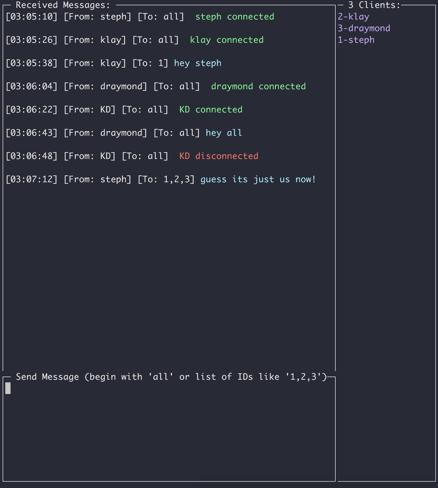

# Chat App

Chat application written in Go.

The chat application is two separately runnable components: a hub (server) and a client.
 
The implementation uses a Console UI, TLS connection, and concurrency via channels. 

Note: *_This app is a proof of concept only and should not be used seriously._*
 The self-signed TLS private key and public keys have been committed to this repository for ease of use. In a real world scenario, we would of course not commit these files unencrypted or preferably not at all.


### Prerequisites

This app assumes a working Go setup

## Getting Started

To get going...

Either clone the repository,
```
git clone https://github.com/martinmarks/chat.git
``` 
 
 or 

```
go get github.com/martinmarks/chat

```

### Running the server/hub

```
go run cmd/hub/main.go
``` 
 
 or 

```
go build -o ./hub ./cmd/hub/
./hub
```


### Running the client

```
go run cmd/client/main.go
``` 
 
 or 

```
go build -o ./client ./cmd/client/
./client
```

## Screenshot


## Running the tests

```
go test -v ./pkg/chat/
```

## Sending messages from the Client UI
The list of Clients on the right side of the app is in the format of {ClientID}-{Name}

You can use the ClientID to message specific Clients like:

```
1,2 hello my best friends

^^ the above will message "hello my best friends" to client IDs 1 and 2
```

Or, to message all Clients:
```
all hello everyone!

^^ the above will message "hello everyone!" to all connected clients
```

A message must begin with either "all" or a comma-separated value of Client IDs.


## Tailing logs of all messages
All chat messages will be printed to standard out of the hub app, but you can also tail that data in a log file:

```
tail -f hub.log
```

## Built With

* [gocui](https://github.com/jroimartin/gocui) - Framework used to develop the Console User Interface


## Thoughts
I had a lot of fun working on this project!  I've always wanted to mess around with writing apps that run in Terminal/Console, and chat is a great use case that has room for fun concurrency.

 It took me the better part of a day to complete, and I could have easily kept going but wanted to respect the suggested time limit.

## Future Considerations
If I had more time, I would have focused on the following items:

* More thorough testing, in particular areas using concurrency. Unit testing these areas can be tricky and unfortunately fell victim to the time limit.
* Metrics and observability. I feel like no project is complete until you can easily see how its running at a distance. I would have loved to sent stats on total messages sent, latency time, etc to some kind of upstream.
* Username and Password authentication - I almost added this, but without persistence for the credentials I didn't see a lot of value. If I added a database, we could certainly store user credentials and keep a consistent user ID/Name/Password combo.
* Offline message delivery. If a client is offline when someone else tries to message, currently that message is dropped forever. It wouldn't be hard to keep a queue of messages for each user, to be displayed on their next login.
* Reconnect logic on the client (currently the app just closes if the server connection drops)

